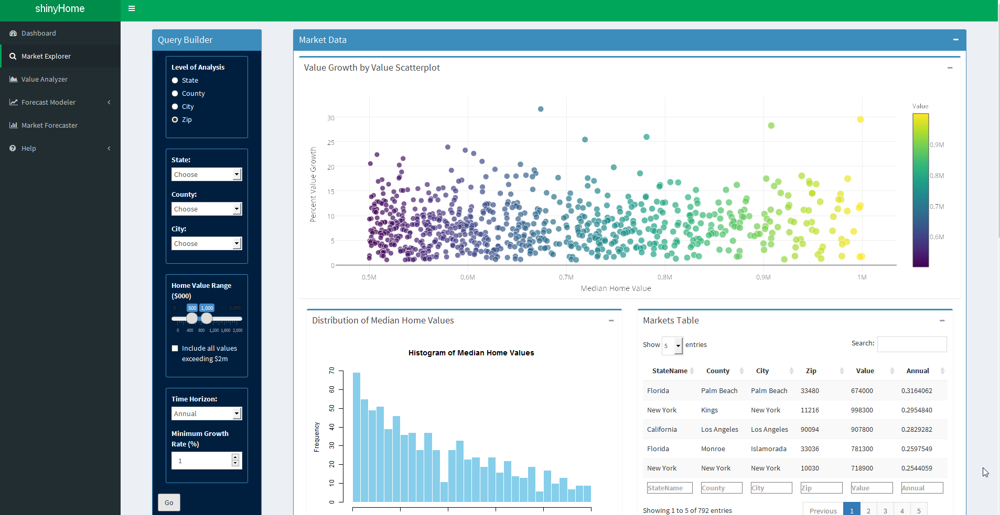
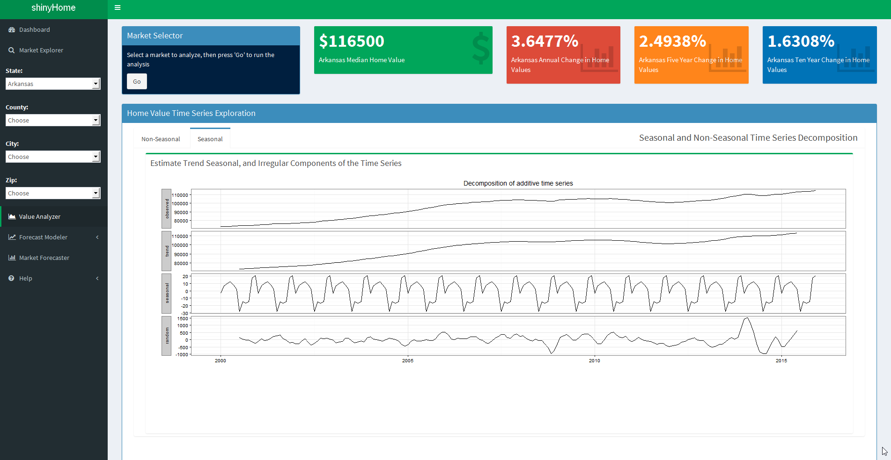
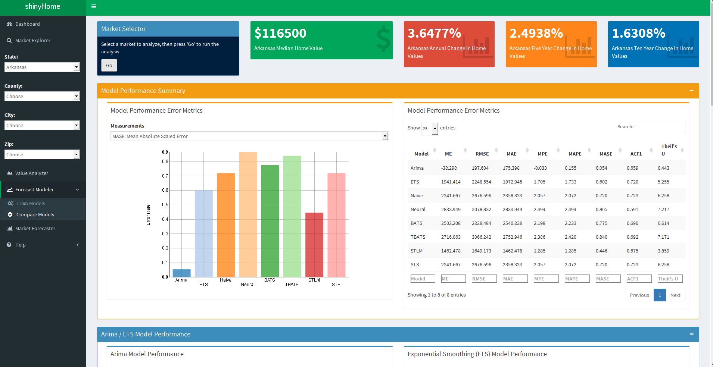
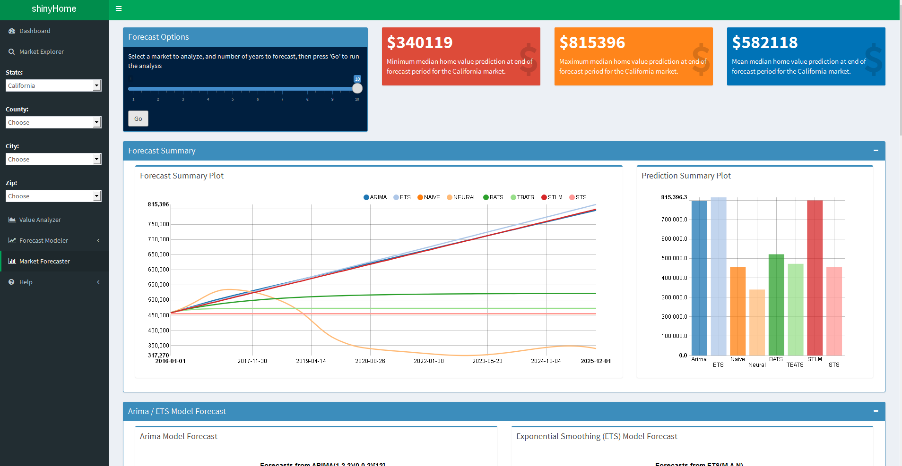

---
title       : Introduction to shinyHome
subtitle    : Product Pitch
author      : John James
job         : Coursera Building Data Products, Data Science Specialization
framework   : io2012        # {io2012, html5slides, shower, dzslides, ...}
highlighter : highlight.js  # {highlight.js, prettify, highlight}
hitheme     : tomorrow      # 
widgets     : []
mode        : selfcontained # {standalone, draft}
knit        : slidify::knit2slides
ext_widgets : {rCharts: [libraries/nvd3]}

--- 
## Explore Markets
Explore over 20,000 markets by geography, home value price ranges and growth rates, then examine the distribution of home values, and discover the top markets by home value growth and, for the top growth markets, a time series of price movements since 2000.  

```{r echo = FALSE, out.width = 1000, fig.retina = NULL}

```

--- 

## Analyze Markets
Analyze home value price trends for selected markets. Evaluate non-seasonal price trends and decompose seasonal movements into their trend, seasonal and random components.

```{r echo = FALSE, out.width = 1000, fig.retina = NULL}

```

--- 

## Train Forecast Models
Select a market, create training and test sets, then train eight of the most acknowledged time series forecasting algorithms, including Arima, Basic Structural, Naive, Neural Networks, Automated forecasting with exponential smoothing and others. Inspect forecast error statistics to evaluate forecast accuracy of each model.

```{r echo = FALSE, out.width = 1000, fig.retina = NULL}

```


--- 

## Forecast Home Value Prices
Using each forecast algorithm, predict home value prices for up to 10 years.  Forecast plots will evince predictions with confidence intervals and the summary plot will allow you to compare time series forecasts among the algorithms.

```{r echo = FALSE, out.width = 1000, fig.retina = NULL}

```
